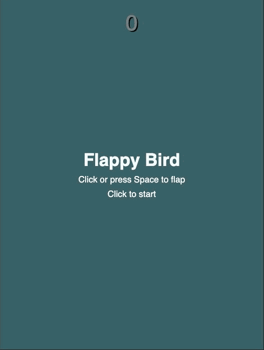

# Flappy Bird Clone
Browser-based Flappy Bird recreation in vanilla JavaScript.
**[▶ Play it live](https://gaelp1986.github.io/flappy-bird-clone/)**

## How it works
- Game loop via `requestAnimationFrame` (~60fps)
- Physics: gravity accumulates velocity each frame; flap resets velocity to a fixed upward impulse
- Collision: AABB checks between bird and pipe pairs
- Score (+1 per pipe passed) and high score persisted with `localStorage`
- Difficulty ramp: pipe speed increases and gap height shrinks as score rises, with a floor so it never becomes impossible
- 8-bit pixel-art bird (flap-animated) and pipe sprites, CC0/public domain (opengameart.org), plus a procedural pixel sky/floor

## Run locally
Open `index.html` in a browser. That's it.

## Built with
Vanilla JS/HTML/CSS.
- AI for
scaffolding, human review and ownership of all game logic.

Originally built at All Star Code (2023); rebuilt and expanded 2026.
